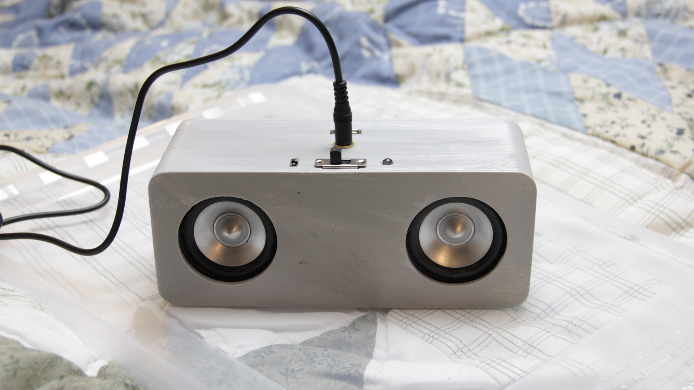
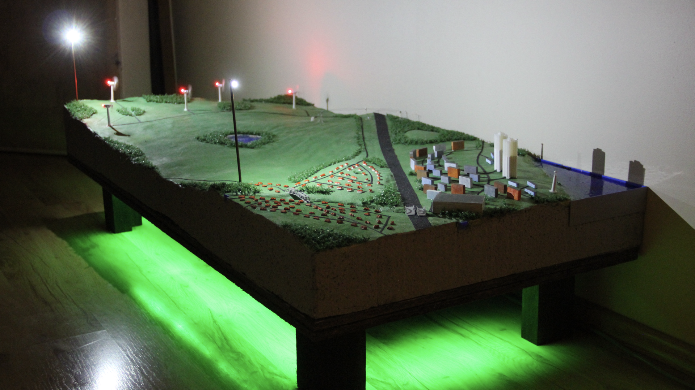
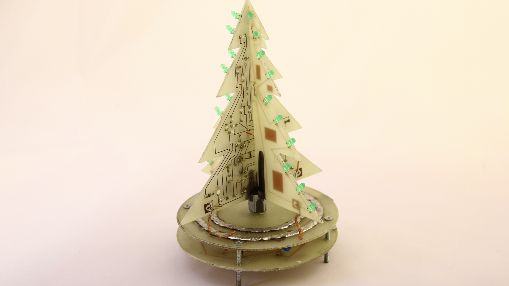
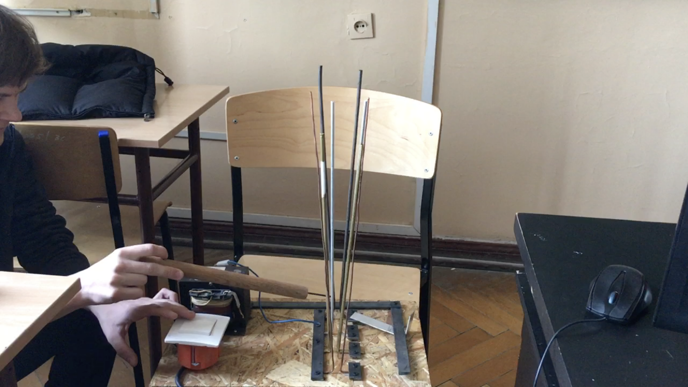
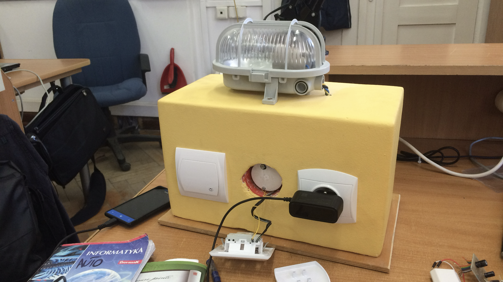
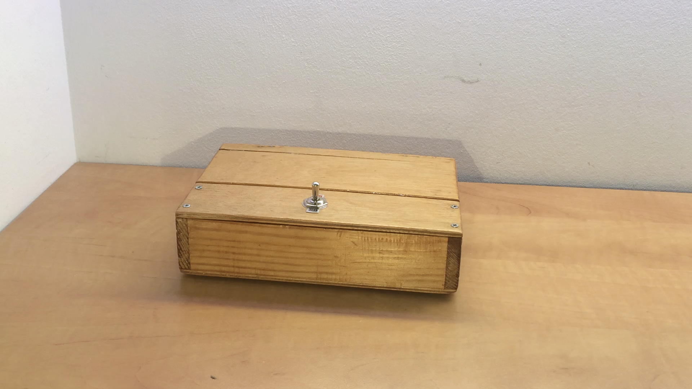
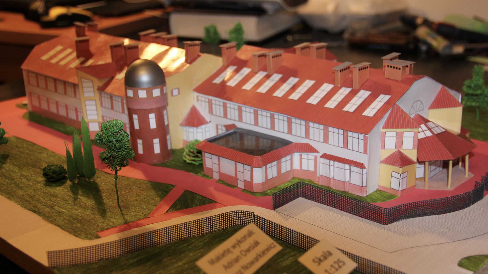

# aboutMe

This repository contains a collection of my designs created over the years - at least a few of them worth, or possible to share. 

## 2024

### [HSSmartModule](https://github.com/lukasznowarkiewicz/HSSmartModule)

HSSmartModule is a light controller for existing electrical installations, aka smart relay module. It is intended to be inserted behind existing light switch in a flush-mounted box. Iniitially designed for [Home Span](https://github.com/HomeSpan/HomeSpan) software, which later on could be replaced with custom app enabling thread functionality. Device is divided into 2 rigid PCBs, which are connected with flexible circuit board to minimalise the overall size of the device. Low voltage PCB includes ESP32-C6 (featuring Wi-Fi 6, Bluetooth 5 LE, Thread, Zigbee radio), SPI flash memory, U.FL antenna connector, status LEDs and user button (for factory defaults). High voltage PCB is designed for power conversion from 230VAC to 12VDC via an LNK3204D non-insulated supply, reads control signals from external switches, control 2 outputs, measure power draw using CS5480-INZ power meter and shunt resistors. Additionally designed custom insulated programmer based on CP2102N. 

### [M2SmartHome](https://github.com/lukasznowarkiewicz/M2SmartHome)

M2SmartHome is an add-on card designed to transform any M.2 2280 Key M-equipped device into a smart home gateway. The main goal is to allow booting the operating system (for ex. home assistant) from flash storage, store configurations or backups on removable medium like uSD card, connect wirelessly to home wifi and control smart home devices via thread or zigbee radio. It is done by PCIe to USB bridge, to which are conencted all remaining peripherals. For OS installation medium choosen eMMC mmeory with USB2244 controller. For storing configuration uSD card reader with also USB2244 controller. For WiFi connectivity is responsible chip from Realtek RTL8188 with U.FL connector for external antenna. Thread or zigbee functionality is done by chip from Silicon Labs communicating with PC through CP2102N USB-Uart bridge. 

### [iPhone13MiniCoolingCase](https://github.com/lukasznowarkiewicz/iPhone13MiniCoolingCase)

iPhone13MiniCoolingCase is a custom-engineered, passively cooled case designed to tackle the overheating issues encountered during high-demand scenarios like continuous navigation, high screen brightness, and multi-tasking in direct sunlight. Using Fusion 360 for thermal simulations and CAD modeling, the project integrates a CNC-machined Aluminum 6061 heatsink—featuring meticulously studied geometric patterns and air channels—with a flexible, 3D-printed TPU casing. Extensive testing revealed significant improvements, reducing the charge-up time from 3:37 to 1:50, marginally boosting Geekbench scores, and eliminating the dreaded "Charging On Hold" notification.

### [HSRGB](https://github.com/lukasznowarkiewicz/HSRGB)

Home Span RGB Control Board is a custom-designed PCB with an ESP32-C6, initially aimed at enabling seamless integration of WS2812B LED strips with Apple HomeKit via [HomeSpan firmware](https://github.com/HomeSpan/HomeSpan). The board features robust power management with a USB-C 15W input, a 3.3V LDO regulator, overcurrent protection via an AP22615 load switch, and a CP2102 USB UART bridge for easy programming, while also incorporating peripherals such as a user button and a TSOP4838 IR receiver for potential extended functionality. 

## 2023

### [SOM Module based on Rockchip RK3399](https://github.com/lukasznowarkiewicz/SOM_MODULE)

This project, completed as part of a course at Poznań University of Technology, involved designing a SOM module compatible with the FriendlyElec SOM-RK3399. The focus was on advanced high-speed PCB design, including detailed impedance calculations for various trace types and interfacing with RAM, eMMC, and Ethernet. Due to the complexity and costs associated with BGA assembly, the project remained at the conceptual stage, emphasizing the learning of advanced Altium Designer techniques.

### [CocktailMaker](https://github.com/lukasznowarkiewicz/cocktailMaker)

cocktailMaker was built purely for fun—a prototype designed for a New Year's Eve party. The project evolved from an earlier engineering thesis, integrating a Raspberry Pi Zero 2 running Debian with a 7-inch touchscreen for the user interface and a Raspberry Pi Pico managing an 8-channel relay module for peristaltic pumps. The UI was developed in Python using customTkinter, while low-level control on the Pi Zero was handled in C. With a mechanical structure designed in Fusion 360 and assembled using extruded V-slot 2020 profiles, 3D-printed parts, and milky plexiglass panels, the cocktailMaker performed reliably for an 8-hour stretch, making it a fun and successful experiment for the event.

### [TeaMachine](https://github.com/lukasznowarkiewicz/teaMachine)

teaMachine was conceived as an academic project to create a modular, automated tea maker that integrates mechanical design, embedded hardware, embedded software to streamline tea preparation much like modern coffee machines. The project leverages a custom Raspberry Pi Pico control board (designed in KiCad) running C firmware, with control interfaces developed across platforms—from Windows 10 IoT Core (.NET Core) and Debian (Vue + Vite) to Python with customTKinter. Everything housed within a robust mechanical structure built from 2020 aluminum profiles, polycarbonate panels, and 3D-printed components designed in Fusion 360. It employs both high-voltage SSRs and low-voltage mechanical relays to manage components such as heaters, pumps, and motors, while integrating various sensors and user interfaces for comprehensive system control. Ultimately, teaMachine served as an extensive academic project that successfully demonstrated cross-disciplinary integration and iterative development, providing valuable insights into mechatronics, embedded systems, and software engineering.

## 2022

### [Plant growing containers](https://github.com/lukasznowarkiewicz/PlantGrowingContainers)

PlantGrowingContainers was initiated as a research platform to study the impact of electromagnetic fields on plant growth by comparing controlled and experimental samples in two remotely managed, automated boxes. The system is built around an ESP32 microcontroller that gathers environmental data from sensors measuring temperature, humidity, light intensity, magnetic forces, and atmospheric pressure, while an 8-relay module controls actuators like fans, LED strips, and a peristaltic pump for irrigation. The hardware design features a robust power supply that steps down from 230VAC to 12VDC and 5VDC, and the mechanical framework is meticulously crafted in Fusion 360 using V-slot aluminum profiles, plywood enclosures, and custom 3D-printed components. Additionally, an ESP32 camera module paired with a local server and [Filka.io](http://Filka.io) integration enables continuous image capture and real-time data visualization to support comprehensive research analysis.

## 2021

### Wireless charging system

## 2020

### [Emersense](https://github.com/lukasznowarkiewicz/Emersense)

Emersense was an attempt to develop a system for alerting drivers about approaching emergency vehicles amid urban noise, using an ESP32 running custom C code on ESP-IDF. The device combined an INMP441 MEMS microphone with a legacy electret mic to capture audio signals and used DFT-based processing to identify two-tone sirens. Its hardware also included a CP2102N for USB connectivity, an XL1509 for voltage conversion, a SI4713 FM transmitter with RDS, an MPU-6050 for motion detection, and an SPI-driven LCD—all integrated on a custom KiCad PCB and housed in a Fusion 360–designed enclosure. Although preliminary testing offered some insights, various challenges in signal processing and resource limitations ultimately led to the project’s discontinuation, providing valuable lessons rather than a market-ready solution.

## 2018 - 2019

### [Appliance connector](https://github.com/lukasznowarkiewicz/ApplianceConnector)

Appliance Connector was developed to bridge the gap between legacy devices—such as IR-controlled TVs, RS232-based projectors, and dry contact systems—and modern smart home networks using TCP/IP and REST APIs. Built around an ESP32 module running ESP-IDF FreeRTOS, the project features custom firmware in C that handles IR transmission/reception, UART, LED, and relay control, along with a minimalist web UI crafted in HTML/CSS/JavaScript for device management. The hardware design, prototyped in Autodesk Eagle and Fusion360 with iterative 3D-printed enclosures, evolved into a two-board solution integrating both sensor/IR functions and terminal interfacing. Ultimately, while the prototype showcased promising integration capabilities, the project was abandoned due to academic commitments and emerging commercial alternatives, leaving behind valuable insights in smart home connectivity.

## 2017

### [DeafAlDer](https://github.com/lukasznowarkiewicz/DeafAlDer)

DeafAlDer was conceived to address the need for an accessible, multimodal home alert system tailored for the deaf community, delivering clear visual, tactile, and low-frequency auditory signals to notify users of everyday events and emergencies. The system’s core is a Siemens LOGO! 12/24 RCE PLC that orchestrates a range of custom-designed sensor and actuator modules—including flood and smoke/CO detectors, a kitchen timer, a doorbell, and an ATmega8-based alarm clock with vibration feedback—integrated via Altium-designed PCBs and housed in 3D-printed enclosures from Autodesk Inventor models. Firmware development leveraged Logo Soft Comfort for PLC programming and the Eclipse IDE with C for microcontroller applications, ensuring seamless integration between both proprietary and commercial sensors. Rigorous debugging and iterative enhancements have resulted in a robust, scalable, and cost-effective solution that meets its design specifications, with promising avenues for future improvements such as enhanced gesture sensor performance and broader system integration.

## 2016

### [3dCane](https://github.com/lukasznowarkiewicz/3dCane)

3dCane was developed to empower visually impaired users by providing an intelligent cane that performs 3D environmental scanning and offers both tactile and audio feedback for safer navigation. The system is built around dual 8-bit AVR microcontrollers (ATmega64 in the cane and ATmega328P in the wristwatch), integrating US-015 ultrasonic sensors, NRF24L01 radio modules, ADXL accelerometers, a DS3231 RTC, and microSD storage, with firmware written in C using Eclipse Indigo. The prototype successfully demonstrated real-time obstacle detection and user alerts through robust testing and custom PCB assembly using both THT and SMT techniques. Although the project showcased promising results in competitive innovation, limitations in sensor data processing, communication range, and unfinished features like illumination highlight areas for further refinement.

## 2010 - 2015

### Bluetooth Speaker

### Wind Turbine Model

### Christmas Tree

### Jacob's Ladder

### Light Control Module

### Useless Box

### Building Model

